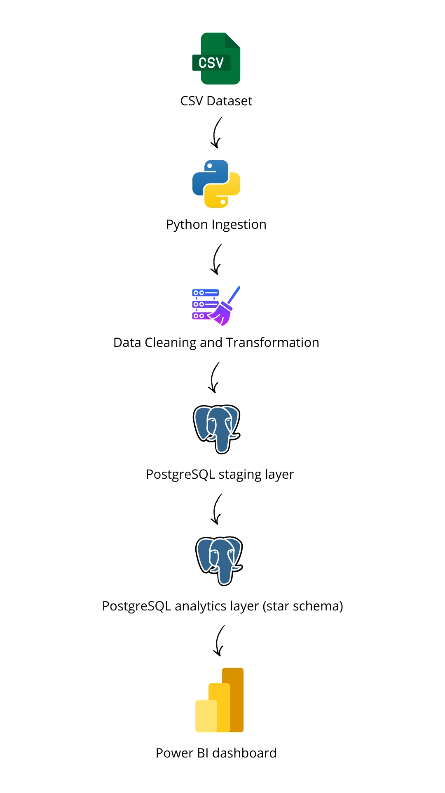
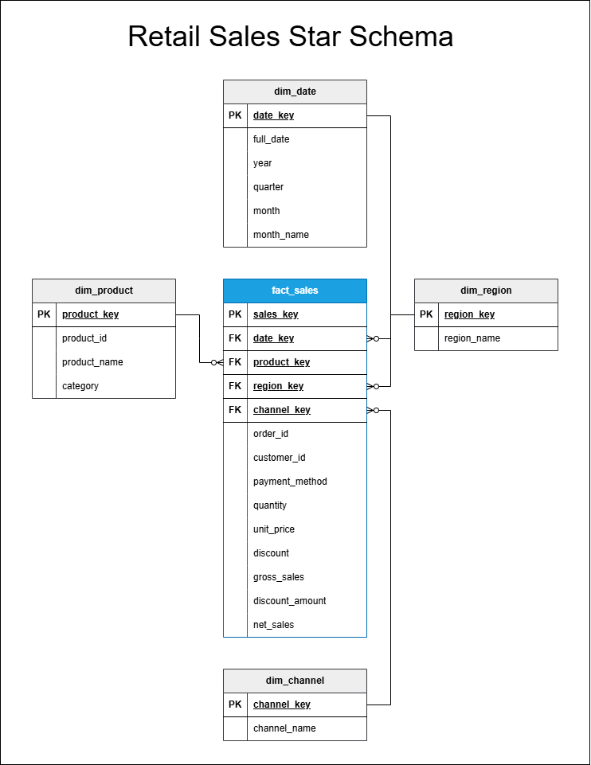
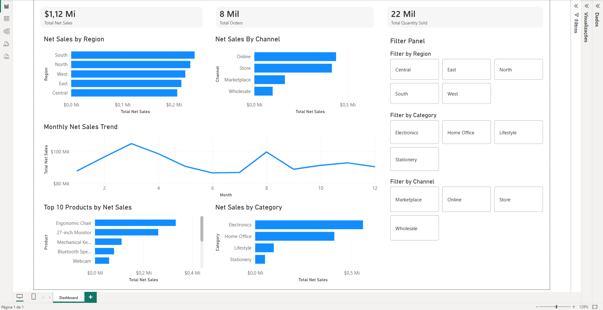

# Retail Sales Data Pipeline

An end-to-end batch data engineering portfolio project that ingests raw retail sales data from CSV, cleans and transforms it with Python and Pandas, loads it into PostgreSQL, models analytics-ready tables in a star schema, and exposes the results to Power BI for business reporting.

---

## Business Scenario

A retail company wants to analyze sales performance across regions, products, categories, and sales channels.

Raw transactional data arrives as CSV files and must be transformed into a clean, analytics-ready dataset suitable for downstream BI dashboards and business analysis.

This project simulates that scenario by implementing a lightweight but realistic batch pipeline from raw data ingestion to analytical consumption.

---

## Project Goals

This project was designed to demonstrate core Data Engineering skills in a portfolio-friendly format:

- ingest raw retail sales transactions from CSV
- clean and standardize data using Python and Pandas
- load curated data into PostgreSQL
- build a dimensional model using a star schema
- validate data quality and referential integrity
- expose analytics-ready tables to Power BI
- document the project clearly for GitHub presentation

---

## Architecture

The pipeline follows this flow:



---

## Tech Stack

- **Python**
- **Pandas**
- **PostgreSQL**
- **SQL**
- **SQLAlchemy**
- **Power BI**

---

## Repository Structure

```text
retail-sales-data-pipeline/
│
├── data/
│   ├── raw/
│   │   └── retail_sales_raw.csv
│   └── processed/
│       └── retail_sales_clean.csv
│
├── etl/
│   ├── __init__.py
│   ├── config.py
│   ├── extract.py
│   ├── transform.py
│   ├── load.py
│   └── run_pipeline.py
│
├── sql/
│   ├── ddl/
│   ├── transformations/
│   ├── analytics/
│   └── quality/
│
├── analysis/
│   ├── business_questions.md
│   └── powerbi/
│       ├── dashboard_notes.md
│       └── screenshots/
│
├── docs/
│
├── requirements.txt
├── .env.example
├── .gitignore
└── README.md
```

---

## Dataset

The project uses a synthetic retail sales CSV dataset built to simulate a realistic sales environment.

### Raw dataset fields

- `order_id`
- `order_date`
- `region`
- `channel`
- `product_id`
- `product_name`
- `category`
- `unit_price`
- `quantity`
- `discount`
- `customer_id`
- `payment_method`

### Data issues intentionally included

To make the ETL more realistic, the raw dataset includes controlled quality issues such as:

- duplicated rows
- missing discounts
- missing product names
- zero-quantity rows
- inconsistent text formatting

---

## ETL Pipeline

The ETL pipeline is implemented in Python and organized into modular steps:

### Extract
- read the raw CSV file
- validate expected columns
- return the raw DataFrame

### Transform
- remove duplicates
- standardize text columns
- fix missing values
- enforce numeric types
- remove invalid rows
- derive business metrics

### Load
- load curated data into `staging.sales_raw`
- create analytics tables in PostgreSQL
- populate dimensions and fact table

### Derived metrics

The pipeline computes the following business metrics:

- `gross_sales = unit_price * quantity`
- `discount_amount = gross_sales * discount`
- `net_sales = gross_sales - discount_amount`

---

## Data Warehouse Design

The PostgreSQL warehouse is organized into two schemas:

### `staging`
Stores the cleaned transactional dataset before dimensional modeling.

### `analytics`
Stores the star schema used for analytical reporting and Power BI consumption.

---

## Dimensional Model

The analytics layer uses a simple star schema:

### Dimensions
- `analytics.dim_date`
- `analytics.dim_product`
- `analytics.dim_region`
- `analytics.dim_channel`

### Fact
- `analytics.fact_sales`

### Fact table measures
- `quantity`
- `unit_price`
- `discount`
- `gross_sales`
- `discount_amount`
- `net_sales`

This model was designed to support common retail analytics use cases while keeping the project simple and portfolio-friendly.



---

## Data Quality Checks

The project includes SQL-based validation checks to ensure warehouse reliability.

Checks include:

- orphan foreign key detection
- negative net sales detection
- blank dimension value checks
- row count validation between staging and fact tables

### Validation results
The implemented checks confirmed that:

- all foreign keys are valid
- no negative net sales rows exist
- staging and fact row counts match
- the analytics layer is referentially consistent

---

## Example Analytical Queries

The project includes reusable SQL queries to answer business questions such as:

- Which regions generate the highest net sales?
- Which sales channels perform best?
- What are the top-selling products by revenue?
- How do sales trend month over month?
- Which categories contribute most to total net sales?

Example insight from the dataset:

- **South** is the top-performing region by net sales
- **Online** is the highest-performing sales channel

---

## Power BI Dashboard

The final analytics layer is connected to Power BI to demonstrate downstream BI consumption.

### Tables used in Power BI
- `analytics.fact_sales`
- `analytics.dim_date`
- `analytics.dim_product`
- `analytics.dim_region`
- `analytics.dim_channel`

### KPI cards
- **Total Net Sales**
- **Total Orders**
- **Total Quantity Sold**

### Visuals included
- **Net Sales by Region**
- **Net Sales by Channel**
- **Monthly Net Sales Trend**
- **Top 10 Products by Net Sales**
- **Net Sales by Category**

### Filters included
- Region
- Category
- Channel

Additional dashboard notes are available in:

```text
analysis/powerbi/dashboard_notes.md
```

---

## Dashboard Screenshots

### Dashboard overview
Add your main screenshot here after saving it to:

```text
analysis/powerbi/screenshots/retail-sales-dashboard-overview.jpg
```

Example markdown:

```md

```

### Optional filtered view
You can also include an additional filtered screenshot, for example:

```text
analysis/powerbi/screenshots/retail-sales-dashboard-filtered-central.jpg
```

Example markdown:

```md

```

---

## How to Run Locally

### 1. Clone the repository

```bash
git clone <your-repo-url>
cd retail-sales-data-pipeline
```

### 2. Create and activate a virtual environment

```bash
python -m venv .venv
```

Windows PowerShell:

```bash
.\\.venv\\Scripts\\Activate.ps1
```

### 3. Install dependencies

```bash
pip install -r requirements.txt
```

### 4. Configure environment variables

Create a `.env` file based on `.env.example`:

```env
DB_HOST=localhost
DB_PORT=5432
DB_NAME=retail_sales_dw
DB_USER=postgres
DB_PASSWORD=your_password_here
```

### 5. Make sure PostgreSQL is running

Create the project database:

```sql
CREATE DATABASE retail_sales_dw;
```

### 6. Run the pipeline

```bash
python -m etl.run_pipeline
```

This will:

- read the raw CSV
- clean and transform the dataset
- load data into PostgreSQL staging
- build the analytics star schema

### 7. Connect Power BI

In Power BI Desktop, connect to:

- **Server**: `localhost:5432`
- **Database**: `retail_sales_dw`

Then import the five analytics tables and build the report visuals.

---

## Project Deliverables

This project includes:

- Python ETL scripts
- PostgreSQL staging and analytics schemas
- star schema dimensional model
- analytical SQL queries
- data quality SQL checks
- Power BI dashboard
- GitHub-ready documentation

---

## Why This Project Works as a Portfolio Piece

This project is intentionally focused on clarity and realism rather than complexity.

It demonstrates the ability to:

- structure a small but realistic data pipeline
- work across Python, SQL, and PostgreSQL
- model analytical data for BI consumption
- validate data quality
- communicate a technical project clearly in GitHub

It is small enough to be built quickly, but complete enough to show real Data Engineering capability.

---

## Key Learnings

Through this project, the following skills were demonstrated:

- modular ETL design in Python
- practical data cleaning with Pandas
- PostgreSQL schema and table design
- dimensional modeling using a star schema
- SQL-based analytics and validation
- Power BI integration with a warehouse model
- portfolio-oriented project packaging and documentation
